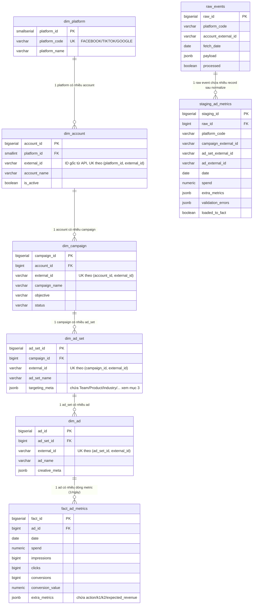

# Database Design Document — Marketing Analytics Dashboard
> Bổ sung cho `docs/01-SPEC.md` mục 4. Tài liệu này mô tả chi tiết quan hệ
> giữa các bảng (ERD), ngữ nghĩa từng cột quan trọng, và lý do thiết kế.
> Nguồn DDL chính thức vẫn là các file trong `database/00X_*.sql` — tài
> liệu này KHÔNG thay thế DDL, chỉ giải thích thêm.

---

## 1. Sơ đồ quan hệ (ERD)



---

## 2. Mô tả quan hệ (cardinality) & ý nghĩa nghiệp vụ

### 2.1 Nhánh Dimension — cấu trúc phân cấp 5 tầng

```
dim_platform (1) ──< (N) dim_account (1) ──< (N) dim_campaign
    (1) ──< (N) dim_ad_set (1) ──< (N) dim_ad
```

| Quan hệ | Loại | Ý nghĩa |
|---|---|---|
| `dim_platform → dim_account` | 1-N | 1 nền tảng (Facebook) có nhiều tài khoản quảng cáo |
| `dim_account → dim_campaign` | 1-N | 1 tài khoản chứa nhiều chiến dịch |
| `dim_campaign → dim_ad_set` | 1-N | 1 chiến dịch chia thành nhiều nhóm quảng cáo |
| `dim_ad_set → dim_ad` | 1-N | 1 nhóm chứa nhiều quảng cáo cụ thể |

Đây là đúng cấu trúc phân cấp thật của Facebook/TikTok/Google Ads (Account → Campaign → Ad Set/Ad Group → Ad) — không phải cấu trúc tự đặt ra, nên khi thêm platform mới, cấu trúc 5 tầng này giữ nguyên, chỉ khác tên gọi (VD Google gọi "Ad Group" thay vì "Ad Set" — vẫn map vào `dim_ad_set`).

**UNIQUE constraint theo composite key** (`(parent_id, external_id)`) ở mỗi tầng — không dùng `external_id` làm UNIQUE toàn cục — vì `external_id` do platform cấp, có thể trùng giữa các account/campaign khác nhau (đặc biệt khi multi-platform, TikTok và Facebook hoàn toàn có thể cấp cùng 1 số ID). Composite key đảm bảo đúng ngữ cảnh.

### 2.2 Nhánh Fact — điểm giao giữa Dimension và số liệu

```
dim_ad (1) ──< (N) fact_ad_metrics
```

`fact_ad_metrics` có `UNIQUE(ad_id, date)` — đây là **grain** (độ chi tiết) của bảng: 1 dòng = 1 quảng cáo × 1 ngày. Mọi truy vấn tổng hợp (theo campaign, theo team, theo platform...) đều là `GROUP BY` ngược lên từ dòng chi tiết này thông qua chuỗi JOIN `fact_ad_metrics → dim_ad → dim_ad_set → dim_campaign → dim_account → dim_platform`.

Vì sao không lưu thẳng `campaign_id` vào `fact_ad_metrics` để đỡ phải JOIN 4 tầng? — Vì đó là **denormalize sớm**, sẽ gây bất nhất nếu 1 ad chuyển giữa các ad_set/campaign (hiếm nhưng có thể xảy ra qua thao tác thủ công trên Ads Manager). Giữ chuẩn hoá, đánh index đầy đủ ở mục 2.4 để bù performance.

### 2.3 Nhánh ETL trung gian — Raw & Staging (không thuộc Star Schema)

```
raw_events (1) ──< (N) staging_ad_metrics
```

Đây là quan hệ **1 raw event JSON → nhiều record staging**, vì `raw_events.payload` là 1 JSON array chứa insight của **toàn bộ ad trong 1 account, 1 ngày** (1 lần gọi API), còn `staging_ad_metrics` là **1 dòng cho 1 ad** sau khi normalize tách từng phần tử trong array ra. Đây là lý do `raw_events` có grain thô hơn `staging_ad_metrics` — đúng như tên gọi "Landing" (thô) vs "Staging" (đã tách/chuẩn hoá).

`staging_ad_metrics` **không có FK cứng** tới `dim_campaign`/`dim_ad_set`/`dim_ad` — chỉ lưu `*_external_id` dạng string. Đây là chủ đích: ở thời điểm staging, dimension record tương ứng có thể **chưa tồn tại** trong DB (VD campaign mới tạo hôm nay, `dim_campaign` chưa kịp có row). Job `load_to_fact` (xem `docs/01-SPEC.md` mục 5.4) chịu trách nhiệm "get-or-create" dimension record rồi mới resolve FK thật khi ghi vào `fact_ad_metrics`.

### 2.4 Index hỗ trợ chuỗi JOIN ngược (dashboard filter theo Campaign/Platform)

Đã định nghĩa ở `database/005_indexes_and_constraints.sql`:
- `idx_dim_ad_ad_set`, `idx_dim_ad_set_campaign`, `idx_dim_campaign_account`, `idx_dim_account_platform` — mỗi index nằm trên cột FK, phục vụ JOIN ngược từ `fact_ad_metrics` lên các tầng dimension khi filter theo Platform/Campaign.
- `idx_fact_date`, `idx_fact_ad_date` — phục vụ filter theo khoảng ngày, pattern query phổ biến nhất của dashboard.

---

## 3. Vùng dữ liệu mở rộng qua JSONB — không phải quan hệ bảng, nhưng cần hiểu rõ ngữ nghĩa

### 3.1 `dim_ad_set.targeting_meta`
Theo giả định đã ghi ở `docs/02-FRONTEND-SPEC.md` mục 0, các dimension mở rộng cho trang Platform Detail (Team, Team Type, Objective, Keymess, Content Group, content_code, Getback, Product, Industry, Sale Team, Month by campaign) **không có cột riêng** — được gom vào `targeting_meta JSONB` của `dim_ad_set`. Đây là lựa chọn hợp lý về mặt kỹ thuật (không phải alter schema liên tục khi nghiệp vụ thêm thuộc tính mới), nhưng có 2 hệ quả cần lưu ý:

1. **Không có FK/constraint kiểm tra giá trị hợp lệ** ở tầng DB cho các field này — VD `team_type` gõ sai chính tả vẫn insert được. Validation phải làm ở tầng ETL/application, không trông chờ DB chặn.
2. **Query filter theo các field này chậm hơn cột thật** nếu không có index — đã có `idx_fact_extra_metrics` (GIN) cho `fact_ad_metrics.extra_metrics`, nhưng `dim_ad_set.targeting_meta` **hiện chưa có GIN index tương ứng** trong `005_indexes_and_constraints.sql`. Nếu dashboard filter theo Team/Sale Team chậm khi data lớn, đây là chỗ cần bổ sung:
   ```sql
   CREATE INDEX idx_dim_ad_set_targeting_meta ON dim_ad_set USING gin (targeting_meta);
   ```

### 3.2 `fact_ad_metrics.extra_metrics`
Chứa các metric custom `action`, `k1`, `k2`, `expected_revenue` — các tỷ lệ dẫn xuất (`cpm`, `cpa`, `cpk1`, `cpk2`, `% chi phí`) **không lưu sẵn**, tính runtime ở tầng backend khi trả API (theo nguyên tắc "không tính toán nghiệp vụ ở frontend" đã thống nhất).

---

## 4. Bảng tổng hợp toàn bộ Foreign Key trong hệ thống

| Bảng con | Cột FK | Bảng cha | Cột tham chiếu |
|---|---|---|---|
| `dim_account` | `platform_id` | `dim_platform` | `platform_id` |
| `dim_campaign` | `account_id` | `dim_account` | `account_id` |
| `dim_ad_set` | `campaign_id` | `dim_campaign` | `campaign_id` |
| `dim_ad` | `ad_set_id` | `dim_ad_set` | `ad_set_id` |
| `fact_ad_metrics` | `ad_id` | `dim_ad` | `ad_id` |
| `staging_ad_metrics` | `raw_id` | `raw_events` | `raw_id` |

Không có FK nào dùng `ON DELETE CASCADE` trong thiết kế hiện tại — xoá 1 dimension record (VD 1 campaign) sẽ bị chặn bởi FK constraint nếu còn `dim_ad_set` con tham chiếu tới, đây là chủ đích để tránh xoá nhầm hàng loạt dữ liệu lịch sử. Nếu về sau cần soft-delete (VD campaign bị xoá bên Facebook), nên dùng cột `is_active`/`deleted_at` thay vì xoá cứng.

---

## 5. Câu hỏi còn mở (cần xác nhận với nghiệp vụ trước khi finalize)

1. `targeting_meta` hiện gộp chung 10+ field khác nhau về ngữ nghĩa (Team thuộc về tổ chức nội bộ, Product/Industry thuộc về phân loại sản phẩm, Content Group/content_code thuộc về sáng tạo nội dung) — về lâu dài có nên tách thành các bảng dimension riêng (`dim_team`, `dim_product`, `dim_content_code`) để có FK thật, validate được, và join nhanh hơn JSONB? Khuyến nghị: **chưa cần** ở giai đoạn demo/MVP, nhưng nên làm nếu số lượng campaign tăng lớn (JSONB filter sẽ chậm hơn cột index thật khi data > vài trăm nghìn dòng).
2. Team Selector Grid (16 ô cố định) — xác nhận lại đây là danh sách tĩnh theo cơ cấu tổ chức (nên hardcode ở frontend, như đã đề xuất) hay là danh mục động cần quản lý qua màn hình admin riêng (nếu vậy cần `dim_team` thật, có CRUD).
